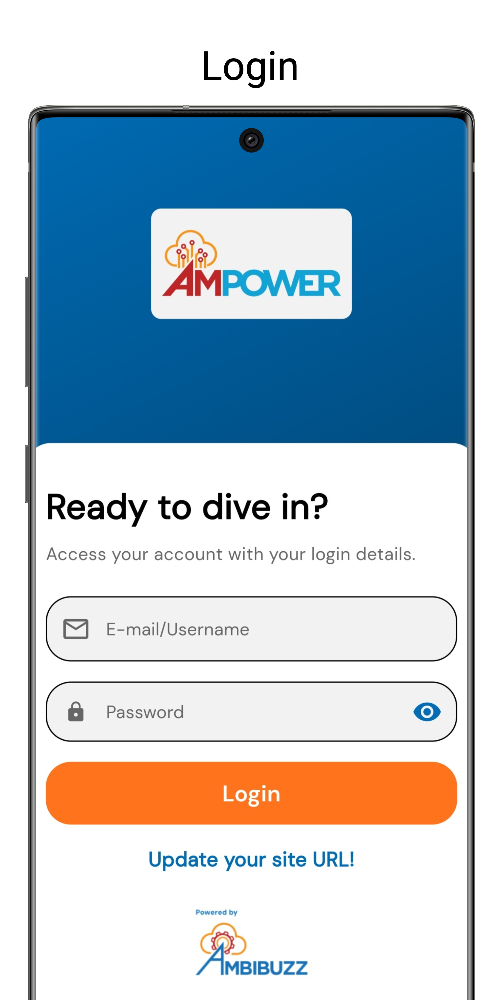
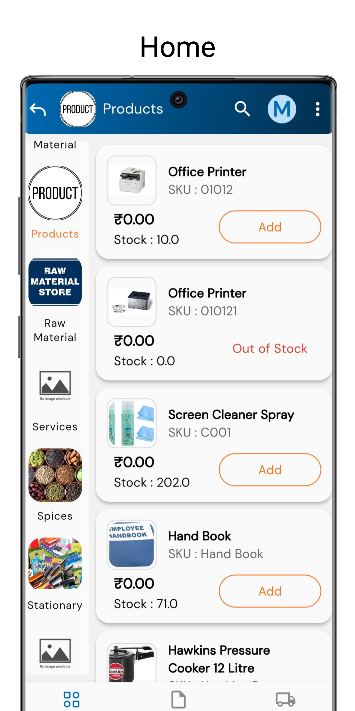
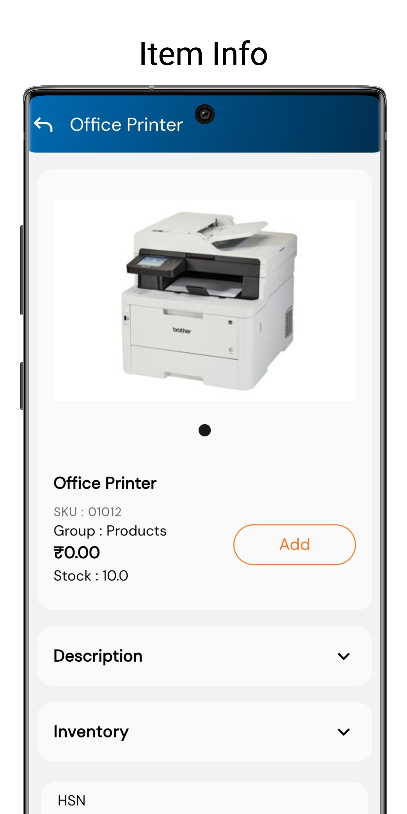
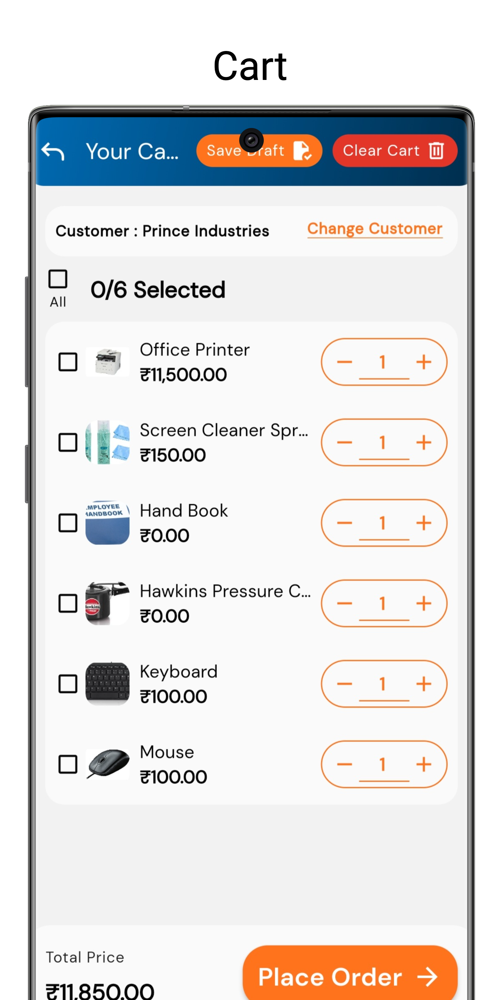

## AmPower OrderIT
AmPower OrderIT is a powerful app designed to streamline sales order booking for customers quickly and efficiently. With an intuitive, visually appealing interface, AmPower OrderIT offers flexible item viewing options tailored to different preferences, including catalog, grid, and list views. Each view is crafted to ensure easy navigation and enhance user experience, allowing representatives to effortlessly browse, select, and place orders on behalf of their customers.

### Tech Stack
- FrontEnd: flutter
- Backend: ERPNext

### App Screenshots

<kbd></kbd>
<kbd></kbd>
<kbd></kbd>
<kbd></kbd>

### Gif


### Features of OrderIT

- Items Displayed in different views i.e list, grid, table and catalogue view
- Customer specific Pricing
- Search Items
- Place Sales Order
- Profile Screen
- Check Past Sales Orders
- Wishlist
- Cart Screen
- Stock Availability

#### Flutter Version : 3.24.2

### To run code
Clone the source code<br/>
```sh
git clone https://github.com/Ambibuzz/ebuzz-Internal.git
```
Then go to cloned directory and open project on android studio or vscode<br/>
Then checkout to ebuzz branch from terminal window of editor<br/>
```sh
git checkout ebuzz
```
For installing packages<br/>
```sh
pub packages get
```
To run the project<br/>
```sh
flutter run
```

### To deploy
Change versions in Pubspec.yaml of project.(Both version and Subversion)
```sh
version: 2.0.0+1
```
#### Android
For Building Apk
```sh
flutter build apk --release
```


#### Ios
For Building Ipa
```sh
flutter build ipa --no-tree-shake-icons
```


### License
MIT